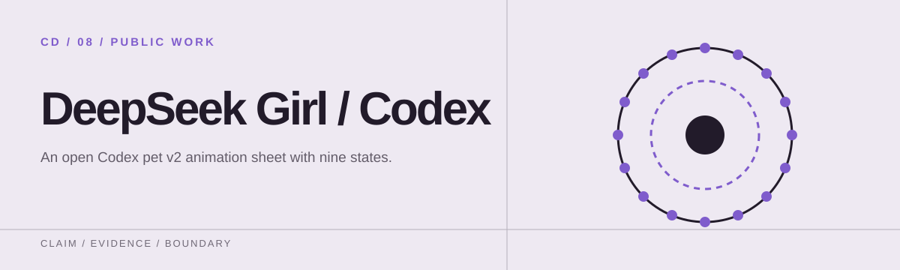
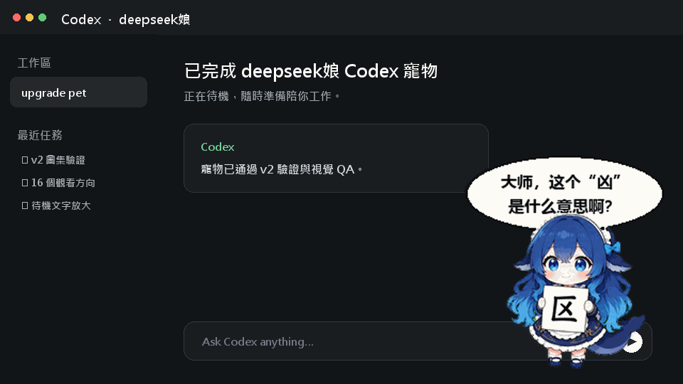

<p align="center">
  
</p>

# deepseek娘codex寵物

一隻為 Codex Desktop 製作的開源 v2 動畫寵物。她有完整的工作狀態動畫、16 個觀看方向，待機時會拿著寫有簡體「区」的板子，並問：

> 大师，这个“凶”是什么意思啊？



> 上圖是以本專案實際待機影格製作的 Codex 工作介面示意動畫，不是 OpenAI 官方產品截圖。

## 特色

- Codex pet v2：`1536 × 2288` WebP 圖集
- 9 種標準狀態動畫
- 16 個順時針觀看方向
- 192 × 208 原生影格
- 待機文字特別放大，板子「区」與對話「凶」刻意不同
- 已通過圖集尺寸、透明背景、色邊與未使用格驗證

## 固定版本下載

[0.1.0 安裝包與 SHA-256](https://github.com/f0909172434/deepseek-girl-codex-pet/releases/tag/v0.1.0) · [驗證、重現與還原](RELEASE.md)

`0.1.0` 是分發版本；pet v2 是動畫格式。

## 安裝

### 一鍵安裝（Windows PowerShell）

```powershell
git clone https://github.com/f0909172434/deepseek-girl-codex-pet.git
cd deepseek-girl-codex-pet
powershell -ExecutionPolicy Bypass -File .\scripts\install.ps1
```

安裝後重新啟動 Codex Desktop，然後在寵物選擇器中選擇 `deepseek娘`。

### 手動安裝

將 `pet` 資料夾完整複製到：

```text
%USERPROFILE%\.codex\pets\deepseek-girl-codex-pet
```

最終結構應為：

```text
.codex/
└─ pets/
   └─ deepseek-girl-codex-pet/
      ├─ pet.json
      └─ spritesheet.webp
```

> OpenAI 官方文件目前沒有公開說明自訂 Codex pet 的安裝介面；以上是本專案驗證過的 Codex Desktop 本機安裝方式，未來版本可能調整路徑或重新載入方式。

## 驗證

```powershell
powershell -ExecutionPolicy Bypass -File .\scripts\verify.ps1
```

驗證腳本會檢查檔案、SHA-256、`pet.json` 欄位與 WebP 尺寸。

本次公開套件的完整 v2 驗證結果保存在 [`qa/atlas-validation.json`](qa/atlas-validation.json)。

## 圖集規格

| 列 | 動畫狀態 |
|---:|---|
| 0 | 待機（6 格 + 中性觀看基準） |
| 1 | 向右移動 |
| 2 | 向左移動 |
| 3 | 揮手 |
| 4 | 跳躍 |
| 5 | 失敗 |
| 6 | 等待使用者 |
| 7 | 工作中 |
| 8 | 審查中 |
| 9–10 | 16 個觀看方向 |

完整圖集 QA 總覽請看 [`assets/contact-sheet.png`](assets/contact-sheet.png)。

## 授權與聲明

本專案以 [MIT License](LICENSE) 開源。

這是社群製作的非官方專案，與 DeepSeek、OpenAI 或 Codex 團隊沒有隸屬、贊助或背書關係。`DeepSeek`、`OpenAI` 與 `Codex` 等名稱及商標歸各自權利人所有。

## 共用圖集維護

此 repository 的 `pet/spritesheet.webp` 是 DeepSeek Girl 兩個 host 的圖集維護來源。[DeepSeek Harness adapter](https://github.com/f0909172434/dsh-deepseek-girl-pet) 以完整 commit、SHA-256 與大小固定來源，保留本機副本，並提供可重跑的同步工具。圖集只在此修改與執行 QA；Harness 的 adapter、套件與安裝網址獨立保留。

既有 v0.1.0 release 與安裝包保持不變；來源治理更新不改寫過去的發布證據。
